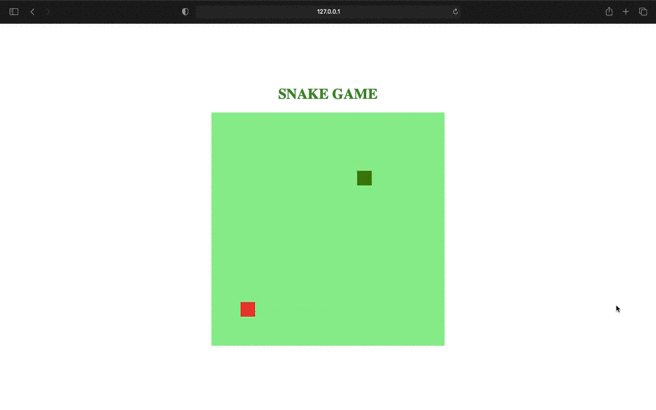

# [Classic] Snake Game​ in JavaScript :snake:

## Description

Snake is a video game that originated during the late 1970s in arcades becoming something of a classic. It became the standard pre-loaded game on Nokia phones in 1998. The player controls a long, thin creature, resembling a snake, which roams around on a bordered plane, picking up food (or some other item), trying to avoid hitting its own tail or the edges of the playing area. Each time the snake eats a piece of food, its tail grows longer, making the game increasingly difficult. The user controls the direction of the snake's head (up, down, left, or right), and the snake's body follows.

## Screenshot

## Getting Started

If you want to download this repository for study purposes, just follow the steps below:

1. Clone the repository

` git clone https://github.com/emidiovaleretto/snake-game-js.git`

2. Run the index.html file in your local browser.

## Author

 Made with  ❤️  by <b>Emidio Valeretto</b>  👋🏽  Get in touch!

 

